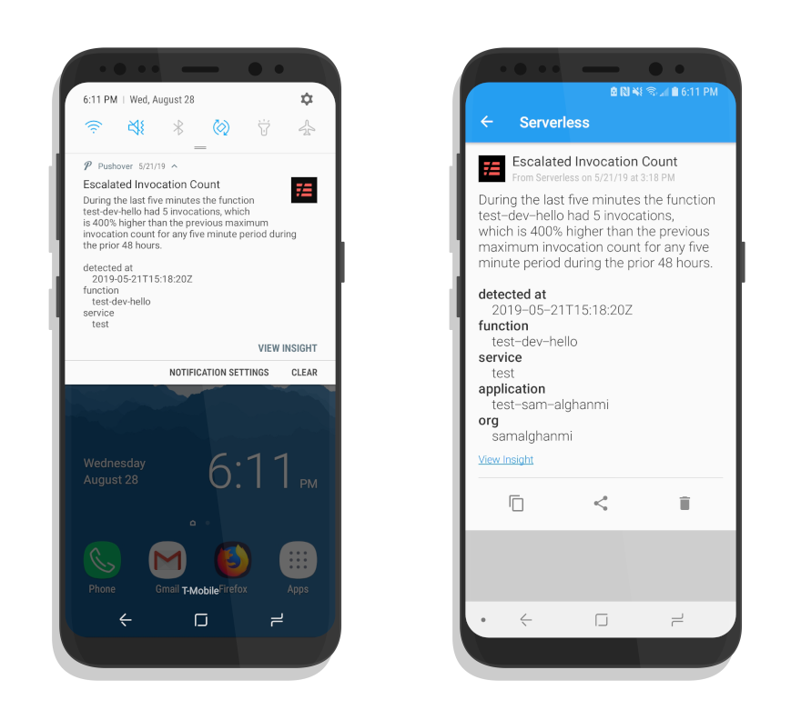

# Serverless Dashboard Pushover Webhook

This is a webhook that forwards webhook requests from
[Serverless Dashboard](https://dashboard.serverless.com)
notifications to [Pushover](https://pushover.net).




## Setup instructions
1. Clone this repo & `cd` into it
   ```shell
   git clone https://github.com/dschep/serverless-dashboard-pushover-webhook
   cd serverless-dashboard-pushover-webhook
   ```
1. Install the serverless framework
   ```shell
   npm i -g serverless
   ```
1. Create a new application on pushover by clicking [this link](https://pushover.net/apps/build)
1. Deploy! Replace `<USER>` and `<APP>` with your Pushover user key and the
   key/token for the app you just created respectively.
   ```shell
   PUSHOVER_USER_KEY=<USER> PUSHOVER_APP_KEY=<APP> serverless deploy
   ```
1. Use the URL for your endpoint from the deploy output in a webhook notification
   configuration on dashboard.serverless.com
